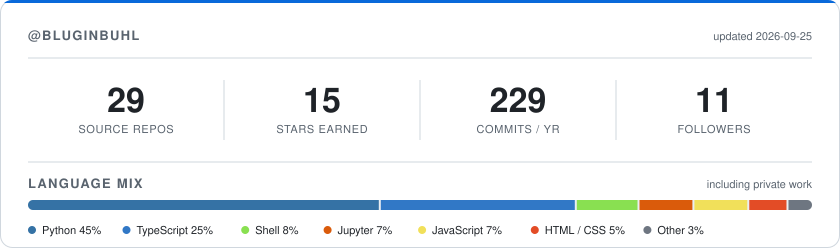

# Benjamin R. Luginbuhl

**Scientific Software · Research Enablement · Materials & Energy**

Flagstaff, AZ

<!-- Badges must stay on one source line; GitHub inserts   between them otherwise. -->
    

---

## About

I'm a materials scientist who became a software developer, and I've kept both
halves. My PhD work was on organic photovoltaics: measuring why solar cells lose
voltage, and using solid-state NMR and molecular dynamics to work out what the
molecules were doing. Somewhere along the way I noticed I was spending more time on
the analysis tooling than on the experiments, and that the tooling was the part
I actually enjoyed more.

Now I build scientific software at [Enthought](https://www.enthought.com/) for
research teams with that same problem: real data, real physics, and not enough spare
engineering time or expertise. The projects range from simple data parsers to full
web apps with visualizations, analysis tools, and reporting built in.

The other half of the job is teaching scientists to do it themselves. I train
research teams in software development practice: scoping a complex project,
building custom tooling, setting up CI/CD, and getting useful work out of AI coding
tools.

Outside of work I do light pollution analysis and dark sky advocacy in
Flagstaff, the world's first International Dark Sky City. The measurement side
of it is not far from the photometry I was doing on solar cells.

The rest of my time goes to camping, hiking, and mountain biking. At home I
play guitar, cook, read, and spend a fair number of evenings gaming.

---

## Currently

<!-- Plain HTML so there's no empty header row. GFM tables always render one. -->
<table>
<tr>
  <td valign="middle"><b>Sr. Scientific Software Developer</b></td>
  <td valign="middle"><a href="https://www.enthought.com/">Enthought, Inc.</a></td>
</tr>
<tr>
  <td valign="middle"><b>Light Pollution Analysis &amp; Consulting</b></td>
  <td valign="middle"><a href="https://darkskypartners.com/">Dark Sky Partners, LLC</a></td>
</tr>
<tr>
  <td valign="middle"><b>Board Member, Dark Sky Awareness &amp; Outreach</b></td>
  <td valign="middle"><a href="https://flagstaffdarkskies.org/">Flagstaff Dark Skies Coalition</a></td>
</tr>
</table>

---

## Research

<!-- RESEARCH_STATS:start -->
[**Google Scholar**](https://scholar.google.com/citations?user=lAqY7oIAAAAJ&hl=en) · 922 citations · h-index 11 · 18 indexed works  Metrics via [OpenAlex](https://openalex.org/), refreshed Aug 2026. Scholar reports higher totals because it indexes more citing sources.
<!-- RESEARCH_STATS:end -->

Organic photovoltaics and photodetectors, non-fullerene acceptors, charge
recombination physics, and more recently machine learning for materials design
and neutron detection.

- **Resolving Atomic-Scale Interactions in Nonfullerene Acceptor Organic Solar Cells with Solid-State NMR Spectroscopy, Crystallographic Modelling, and Molecular Dynamics Simulations**   *Advanced Materials*, 2021 · first author
- **Solution-Processed Semitransparent Organic Photovoltaics: From Molecular Design to Device Performance**   *Advanced Materials*, 2019 · ~300 citations
- **Beyond Molecular Structure: Critically Assessing Machine Learning for Designing Organic Photovoltaic Materials and Devices**   *Journal of Materials Chemistry A*, 2024
- **Tutorial: A Beginner's Guide to Fast Neutron Detection with an EJ-309 Detector**   *Nature Protocols*, 2026

---

## Toolbelt

<!-- Plain HTML so there's no empty header row. Badges stay in markdown:
     GitHub parses it inside a table cell only when blank lines surround it. -->
<table>
<tr>
<td valign="middle"><b>Languages</b></td>
<td valign="middle">

    

</td>
</tr>
<tr>
<td valign="middle"><b>Scientific & ML</b></td>
<td valign="middle">

           

</td>
</tr>
<tr>
<td valign="middle"><b>Materials Informatics</b></td>
<td valign="middle">

     

</td>
</tr>
<tr>
<td valign="middle"><b>AI & LLM</b></td>
<td valign="middle">

    

</td>
</tr>
<tr>
<td valign="middle"><b>Backend</b></td>
<td valign="middle">

   

</td>
</tr>
<tr>
<td valign="middle"><b>Frontend</b></td>
<td valign="middle">

          

</td>
</tr>
<tr>
<td valign="middle"><b>Platform & Tooling</b></td>
<td valign="middle">

       

</td>
</tr>
</table>

---

## GitHub Activity

<picture>
  <source media="(prefers-color-scheme: dark)" srcset="assets/stats-dark.svg">
  
</picture>

Rendered daily by <a href="./.github/workflows/stats.yml">GitHub Actions</a> and committed to this repo. Repository and star counts cover public repositories; the commit count includes private contributions. The language mix is hand-maintained in <a href="./scripts/generate_stats.py">the render script</a>, since public repos hold only a small share of the work.

